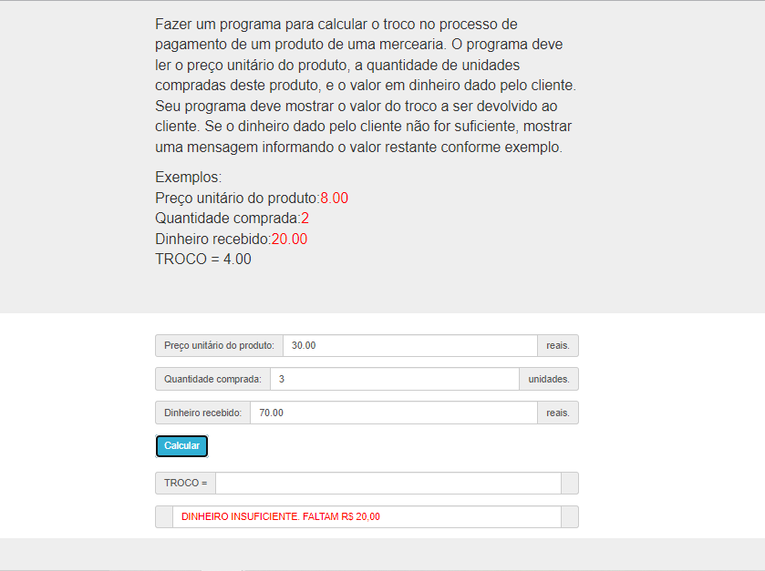

# Jovens Tegranos Exercicio 14

# 🏁 **Tópicos**

 * 👉 Banner
 * 👉 Título e Descrição
 * 👉 Status do Projeto
 * 👉 Funcionalidades
 * 👉 Demonstração da aplicação
 * 👉 Pré-requisitos
 * 👉 Tecnologias utilizadas
 * 👉 Autor
 * 👉 Licença
 
 ____________________________________________________________
# ✅ Banner 👌

<h1 align="center">
  
</h1>

# ✅ Título e Descrição 👌

### Exercicio 14

#### Fazer um programa para calcular o troco no processo de pagamento de um produto de uma mercearia. O programa deve ler o preço unitário do produto, a quantidade de unidades compradas deste produto, e o valor em dinheiro dado pelo cliente. Seu programa deve mostrar o valor do troco a ser devolvido ao cliente. Se o dinheiro dado pelo cliente não for suficiente, mostrar uma mensagem informando o valor restante  conforme exemplo.
    Exemplos:
    Preço unitário do produto: 8.00
    Quantidade comprada: 2
    Dinheiro recebido: 20.00
    TROCO = 4.00
    
    Preço unitário do produto: 30.00
    Quantidade comprada: 3
    Dinheiro recebido: 70.00
    DINHEIRO INSUFICIENTE. FALTAM 20.00 REAIS   

# ✅ Status do Projeto 👌

### 🚧 Projeto 🚀 **Concluído com Sucesso!!!** 👌 🚧

# ✅ Funcionalidades 👌

### - [x] Calcular o troco no processo de pagamento de um produto de uma mercearia.
### - [x] Ler o preço unitário do produto, a quantidade de unidades compradas deste produto, e o valor em dinheiro dado pelo cliente.
### - [x] Mostrar o valor do troco a ser devolvido ao cliente.
### - [x] Se o dinheiro dado pelo cliente não for suficiente, mostrar uma mensagem informando o valor restante

# ✅ Demonstração da aplicação 👌

<h1 align="center">
  
</h1>

### GitHub AlineAlmeida85

### Link: [Projeto](https://alinealmeida85.github.io/Jovens-Tegranos-Exercicio14/)

# ✅ Pré-requisitos 👌

### Nenhum, basta clicar no link acima

# ✅ Tecnologias utilizadas ⚒️ 👌

### As seguintes tecnologias foram usadas na construção do projeto:

- [HTML](https://pt.wikipedia.org/wiki/HTML)
- [CSS](https://pt.wikipedia.org/wiki/Cascading_Style_Sheets)
- [JavaScript](https://www.javascript.com/)

# ✅ Autor 👌

### Aline Almeida 💝

# ✅ Licença

### Não Possui

#### Espero que te agrade! ❤️
